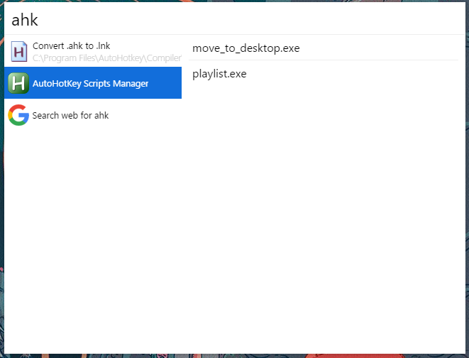

# cerebro-ahk-manager
Simply start/stop yours AutoHotKey scripts

## Usage

* The plugin will read all the .exe scripts that are in %appdata%/cerebro-ahk
* When you search for 'ahk' or 'AutoHotKey' on cerebro, it will show all your scripts
* Selecting a script will make it start and it will be green
* When selecting a script that is already running, it will stop

## Related

* [Cerebro](http://github.com/KELiON/cerebro) – main repo for Cerebro app;
